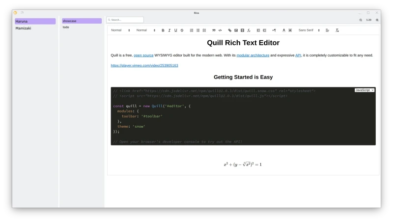

# Rina

A simple note app using the QuillJS rich text editor inside a Qt (QML)
WebEngine.

#### Donate: [GitHub Sponsors](https://github.com/sponsors/g-fb) | [Liberapay](https://liberapay.com/gfb/) | [PayPal](https://paypal.me/georgefloreabanus)

[](https://raw.githubusercontent.com/g-fb/rina/refs/heads/main/data/images/rina.png)

# Dependencies

Dependencies will be printed by `cmake` when building.

# Build

```bash
git clone https://github.com/g-fb/rina
cd rina
cmake -B build -G Ninja
cmake --build build
```
